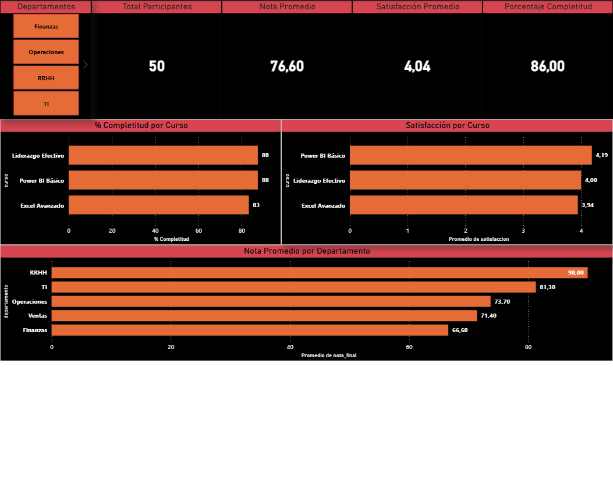

# Dashboard KPIs de Capacitación

## Contexto de negocio
Una empresa OTEC necesita visibilidad sobre la efectividad de sus programas
de capacitación. Este proyecto analiza completitud, rendimiento y satisfacción
de participantes usando SQL para la extracción y Power BI para la visualización.

## KPIs monitoreados
| Métrica | Resultado |
|--------|-----------|
| Total participantes | 50 |
| Tasa de completitud | 86% |
| Nota promedio | 76.6 |
| Satisfacción promedio | 4.04 / 5 |

## Hallazgos principales
- RRHH es el departamento con mejor rendimiento académico (90.0)
- Finanzas tiene la nota más baja (66.6) y menor tasa de completitud
- Power BI Básico es el curso mejor evaluado en satisfacción (4.19/5)
- Excel Avanzado tiene la tasa de completitud más baja (83%)

## Stack

## Archivos
- `capacitacion_sample.csv` — dataset de 50 participantes
- `kpis_capacitacion.pbix` — dashboard Power BI (requiere Power BI Desktop)

## Queries SQL
Los KPIs fueron calculados primero en SQL antes de visualizarlos en Power BI:
- Tasa de completitud por curso
- Nota promedio por departamento  
- Satisfacción promedio por curso
